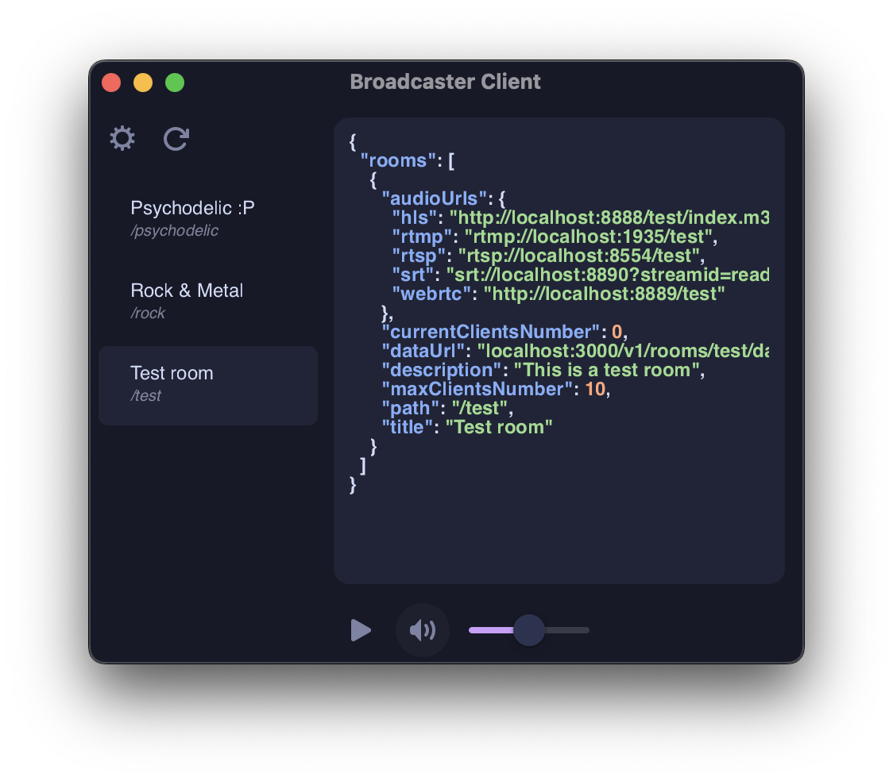
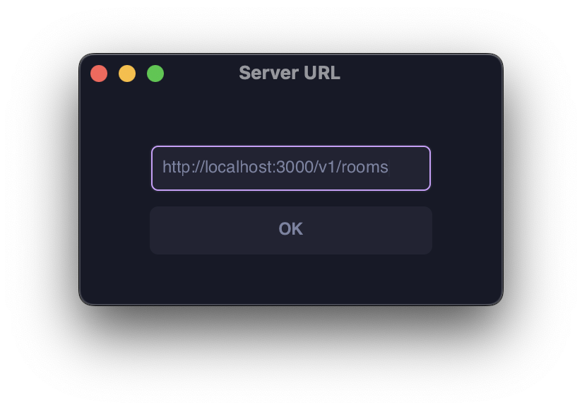

## Custom Audio Broadcaster Client

It's an example client implementation for my other project [custom-audio-broadcaster](https://github.com/seb0xff/custom-audio-broadcaster).




After the client is connected to the server, at the left side of the window you can see a list of available rooms. You can join by clicking on the them. To get additional information about the room, you can hover over the room.
On the top left corner there are buttons to change the server address and to refresh the room list.
On the right side of the window there is the data channel response preview from the server.
Below the preview you can find basic audio controls, play, audio visualizer, mute and volume slider. The visualizer is activated when the play button is pressed. The slider is shown when the mute button is hovered over.

### Dependencies:
(typically installed with your package manager)

- gtk4
- python3.12
- gstreamer
- libadwaita
- librsvg
- [gnt](https://github.com/seb0xff/gtk-native-tweaks) (optional, for better titlebar appearance)

### Installation:

> [!NOTE]
> At the moment there is no release, so you have to do it a bit manually, You need Poetry for this.

```bash
git clone https://github.com/seb0xff/custom-audio-broadcaster-client
cd custom-audio-broadcaster-client
poetry install
poetry shell
python -m custom_audio_broadcaster_client.main
```
